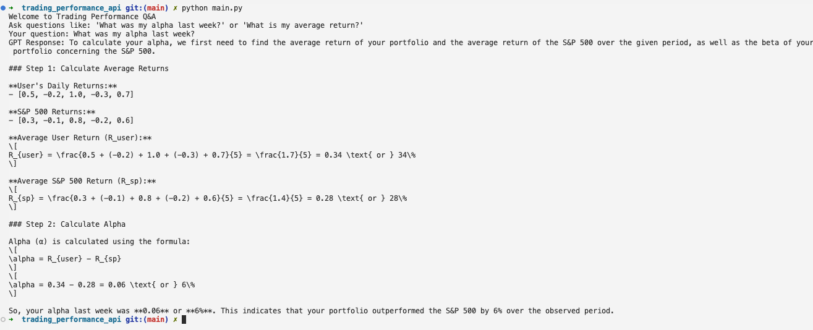
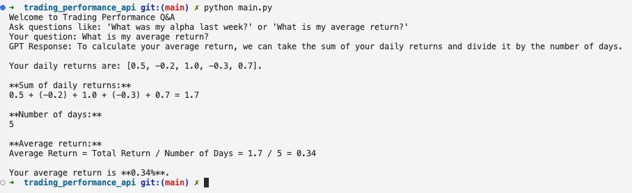

# Trading Performance Q&A Tool

A Python-based tool that uses OpenAI's GPT API to answer user questions about their trading performance. The tool calculates metrics such as **alpha** and **average returns** based on mock performance data.
*What was my alpha last week?*

*What is my average return?*


## Features

- Answers user queries like:
  - "What was my alpha last week?"
  - "What is my average return?"
- Uses OpenAI's `GPT API` to dynamically generate responses.
- Mock data is used for calculations:
  - User's daily returns: `[0.5, -0.2, 1.0, -0.3, 0.7]`
  - S&P 500 returns: `[0.3, -0.1, 0.8, -0.2, 0.6]`

## Prerequisites

1. Python 3.7 or later installed.
2. An OpenAI API key. [Get your API key here](https://platform.openai.com/signup/).

## Installation

1. Clone the repository:
   ```bash
   git clone https://github.com/MunishMummadi/trading_performance_api.git
   cd trading_performance_api